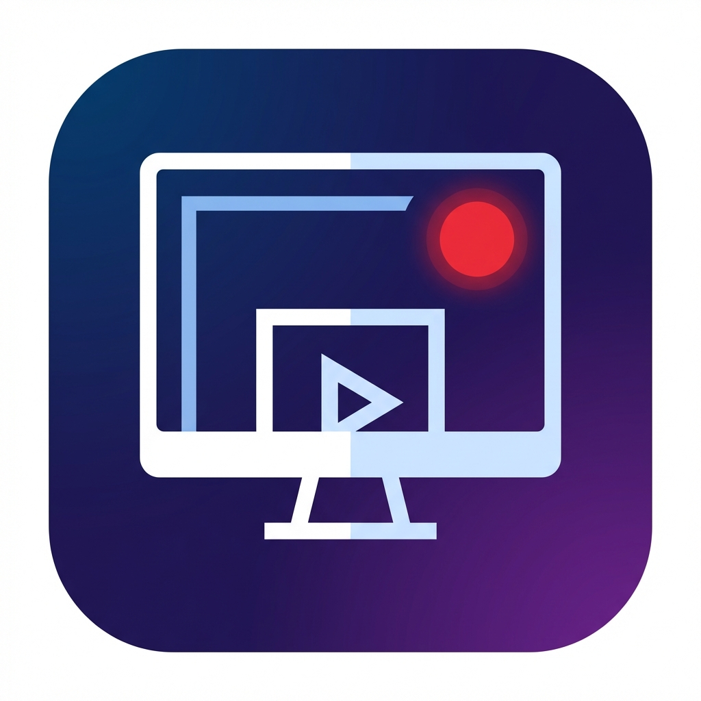

# 🎬 ScreenCapture Pro

**ScreenCapture Pro** — современное, высокопроизводительное и удобное приложение для записи экрана и создания снимков в Windows с поддержкой горячих клавиш, выборочных областей, паузы, аппаратного захвата курсора и стильного интерфейса.



---

## ✨ Основные возможности

- 🖥️ **Запись всего экрана или нескольких мониторов**: поддержка мультимониторных систем (выбор конкретного монитора или виртуального рабочего стола).
- ✂️ **Интерактивный селектор области (Snipping Tool)**: удобное визуальное выделение области экрана с затемнением, подсказками и отображением точных размеров и соотношения сторон (16:9, 4:3, 1:1).
- 💾 **Прямой стриминг на диск (Zero-Memory)**: видеокадры записываются напрямую в файл через OpenCV без накопления в оперативной памяти (минимальная нагрузка на CPU и RAM).
- ⏸️ **Пауза и Возобновление (Pause & Resume)**: мгновенная пауза записи с сохранением плавности видеоряда.
- 🖱️ **Захват и подсветка курсора мыши**: высокоскоростной рендеринг указателя мыши и мягкого полупрозрачного ореола (Halo) для обучающих видео.
- 📸 **Мгновенные снимки экрана (Screenshots)**: быстрое создание PNG-скриншотов всего экрана или выделенной области по горячей клавише `F11`.
- 🎛️ **Плавающая мини-панель управления**: компактный перемещаемый виджет во время записи с живым таймером и кнопками паузы, остановки и скриншота.
- ⏱️ **Анимированный обратный отсчёт (3.. 2.. 1..)** перед началом записи.
- 📁 **Встроенная галерея и менеджер записей**: просмотр списка видео и скриншотов, быстрый запуск в плеере, открытие в Проводнике Windows, удаление.
- 🎨 **Современный UI с темами оформления**: поддержка тёмных и светлых тем (Darkly, Superhero, Solar, Cyborg, Cosmo, Flatly, Minty).
- ⚙️ **Гибкие настройки**: выбор FPS (15, 24, 30, 60), видеокодека (mp4v, avc1, XVID), формата (MP4, AVI, MKV), папок сохранения и кастомных горячих клавиш.

---

## ⌨️ Горячие клавиши по умолчанию

| Клавиша | Действие |
| :--- | :--- |
| **`F5`** | **Старт записи** (с возможностью обратного отсчёта 3..2..1..) |
| **`F6`** | **Пауза / Продолжить запись** |
| **`F10`** | **Остановка записи и сохранение файла** |
| **`F11`** | **Мгновенный снимок экрана (Screenshot)** |
| **`ESC`** | Отмена выделения области в селекторе |

*(Все горячие клавиши можно изменить на свои во вкладке «Настройки»)*

---

## 📁 Архитектура проекта (Чистый код)

```
screenvideo/
├── src/
│   ├── core/                  # Ядро приложения (независимое от GUI)
│   │   ├── config.py          # Конфигурация с автосохранением в JSON
│   │   ├── cursor.py          # Быстрый захват и рендеринг курсора / подсветки
│   │   ├── history.py         # Менеджер сохранённых файлов и метаданных
│   │   ├── hotkeys.py         # Безопасный глобальный менеджер горячих клавиш
│   │   ├── monitors.py        # Определение мониторов и расчет геометрии регионов
│   │   ├── recorder.py        # Многопоточный движок записи с синхронизацией FPS
│   │   └── screenshot.py      # Движок захвата скриншотов в PNG
│   ├── ui/                    # Пользовательский интерфейс (ttkbootstrap)
│   │   ├── views/             # Вкладки приложения
│   │   │   ├── record_view.py   # Главный экран записи и телеметрии
│   │   │   ├── history_view.py  # Галерея видео и снимков
│   │   │   └── settings_view.py # Экран параметров и настроек
│   │   ├── app.py             # Главное окно и координатор приложения
│   │   ├── countdown.py       # Анимированный оверлей обратного отсчёта
│   │   ├── floating_bar.py    # Компактный плавающий виджет управления
│   │   ├── region_selector.py # Интерактивный селектор области экрана
│   │   └── theme.py           # Константы дизайна, шрифты и темы
│   └── utils/                 # Системные утилиты и форматирование
│       ├── formatting.py      # Форматирование времени, байтов, дат
│       └── system.py          # Поддержка High-DPI, проводник Windows, звуки
├── tests/                     # Модульные и интеграционные тесты
│   └── test_core.py
├── main.py                    # Чистая точка входа
├── pyproject.toml             # Зависимости и конфигурация линтера
└── README.md
```

---

## 🚀 Установка и запуск

### Требования
- Python 3.10+ (рекомендуется 3.12+ или 3.14)
- Менеджер пакетов `uv` (или `pip`)

### Запуск в режиме разработки

```bash
# Синхронизация окружения
uv sync

# Запуск приложения
uv run python main.py
```

### Запуск тестов

```bash
uv run python -m unittest discover tests
```

---

## 🛠️ Сборка автономного .EXE (Nuitka)

Для сборки единого быстрого исполняемого файла для Windows:

```bash
uv run python -m nuitka --onefile --windows-console-mode=disable --windows-icon-from-ico=icon.ico --enable-plugin=tk-inter --include-data-file=icon.ico=icon.ico --include-data-file=icon.png=icon.png --output-filename=ScreenCapturePro.exe main.py
```

---

## 📄 Лицензия

MIT License
