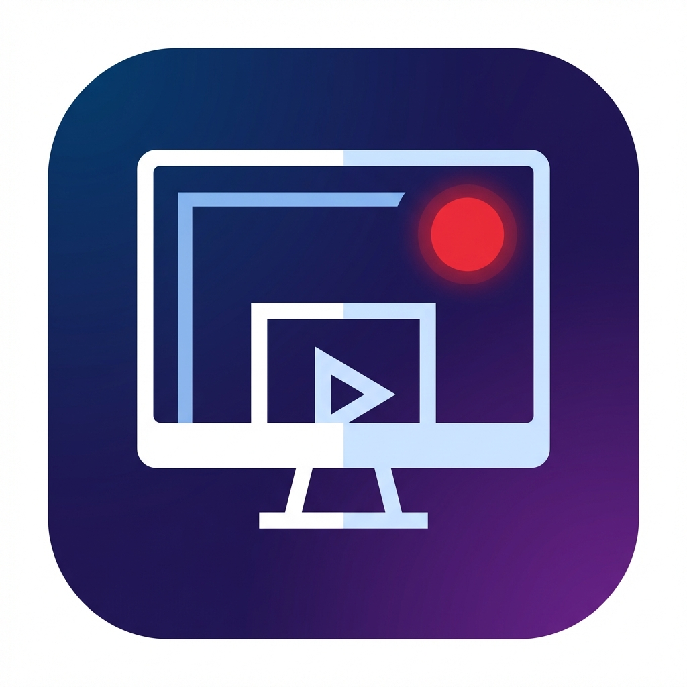

# 🎬 ScreenCapture Pro

[](https://www.python.org/)
[](LICENSE)
[-E91E63.svg)](asm/README.md)
[](https://github.com/eminsk/screenvideo/actions/workflows/ci.yml)

**ScreenCapture Pro** is a modern, high-performance desktop screen recording and screenshot suite for Windows. Engineered with a zero-memory streaming architecture, low-latency WASAPI loopback audio, native Win32/x64 assembly optimizations, customizable hotkeys, interactive region snipping, and a sleek dark/light theme GUI.



---

## ✨ Key Features

- 🖥️ **Full-Screen & Multi-Monitor Support**: Seamless recording across single displays, multi-monitor setups, or virtual desktop workspaces.
- ✂️ **Interactive Region Selector & Snipping Tool**: Real-time visual region selection with darkened overlay, pixel dimensions HUD, aspect ratio guides, and dedicated snipping mode (`Shift+F11`).
- 📋 **Native Windows Clipboard Integration (`CF_DIB`)**: Instantly auto-copies snips and screenshots directly to the system clipboard for immediate `Ctrl+V` paste into Telegram, Discord, Slack, Word, or browsers. Includes 1-click "В буфер" and `Ctrl+C` in the gallery.
- 🔊 **System Audio Capture (WASAPI Loopback)**: Crystal-clear internal sound recording capturing speakers and headphones without external virtual cables.
- 🎤 **Microphone & Multi-Source Audio**: Record voice commentary independently or mixed synchronously with system audio.
- 💾 **Zero-Memory Direct-to-Disk Streaming**: Frames are encoded directly to disk via OpenCV/native pipes without ballooning RAM usage.
- ⏸️ **Synchronous Pause & Resume**: Instant pause and continuation keeping audio and video streams in lockstep.
- 🖱️ **Hardware Cursor Rendering & Halo Highlight**: Fast mouse pointer tracking with an optional translucent glowing halo for presentations and tutorials.
- 🎯 **Mouse Click Ripple HUD**: Real-time visual animated ripple circles on left and right mouse clicks with customizable colors for software demos.
- 🎞️ **Direct GIF Recording & 2-Pass Palette Exporter**: Create lightweight, crystal-clear animated GIFs using two-pass FFmpeg palette generation (`palettegen` + `paletteuse`), perfect for GitHub READMEs and bug reports.
- 📸 **Instant High-Res Screenshots**: Capture fullscreen or region PNG snapshots in one keystroke (`F11`).
- 🎛️ **Floating Mini-Toolbar Widget**: Compact, draggable on-screen controller during active recording with live duration timer and quick-action buttons.
- ⏱️ **Animated Countdown (3.. 2.. 1..)**: Clean pre-recording visual countdown overlay.
- 📁 **Integrated Media Gallery & Manager**: In-app viewer for recorded videos, GIFs, and screenshots, instant playback in default media player, folder reveal, clipboard copying (`Ctrl+C`), and 1-click GIF conversion.
- 🎨 **Modern Themed Interface**: Customizable dark and light palettes powered by `ttkbootstrap` (Darkly, Superhero, Solar, Cyborg, Cosmo, Flatly, Minty).
- ⚙️ **Configurable Encoding**: Adjustable framerates (15, 24, 30, 60 FPS), audio bitrates (128k–320k), container formats (MP4, AVI, MKV, GIF), and custom hotkeys.

---

## ⌨️ Default Hotkeys

| Hotkey | Action | Description |
| :--- | :--- | :--- |
| **`F5`** | **Start Recording** | Begins screen capture (with animated 3..2..1 countdown) |
| **`F6`** | **Pause / Resume** | Instantly toggles recording state without dropping sync |
| **`F10`** | **Stop & Save** | Concludes capture, finalizes file headers, and opens gallery |
| **`F11`** | **Quick Screenshot** | Captures active display/region to PNG immediately |
| **`Shift+F11`** | **Interactive Snip** | Interactive region snipping with crosshair & instant clipboard copy |
| **`ESC`** | **Cancel** | Exits region selection overlay |

*(All hotkeys are rebindable in the Settings tab)*

---

## 📁 Clean Architecture

```
screenvideo/
├── src/
│   ├── core/                  # Core engine independent of UI
│   │   ├── clipboard.py       # Native Win32 CF_DIB clipboard integration
│   │   ├── config.py          # Persistent JSON settings & state
│   │   ├── cursor.py          # Fast pointer capture & halo renderer
│   │   ├── gif.py             # 2-pass animated GIF palette generator
│   │   ├── history.py         # Media catalog & metadata storage
│   │   ├── hotkeys.py         # Safe global low-level keyboard listener
│   │   ├── monitors.py        # Multi-monitor enumeration & geometry
│   │   ├── recorder.py        # Multi-threaded FPS-locked video writer
│   │   └── screenshot.py      # High-performance PNG snapshot engine
│   ├── ui/                    # Presentation layer (ttkbootstrap)
│   │   ├── views/             # Functional views
│   │   │   ├── record_view.py   # Main capture & telemetry control
│   │   │   ├── history_view.py  # Gallery of saved captures
│   │   │   └── settings_view.py # Encoder & audio preferences
│   │   ├── app.py             # Main application coordinator
│   │   ├── countdown.py       # Transparent overlay countdown
│   │   ├── floating_bar.py    # Draggable mini control widget
│   │   ├── region_selector.py # Visual interactive snipping overlay
│   │   └── theme.py           # Typography, palette & styling tokens
│   └── utils/                 # System helpers & formatting
│       ├── formatting.py      # Human-readable time, bitrate & sizes
│       └── system.py          # High-DPI scaling & explorer integration
├── asm/                       # Native x64 assembly performance routines
├── tests/                     # Automated unit and integration tests
│   └── test_core.py
├── main.py                    # Application bootstrap entry point
├── pyproject.toml             # Modern package metadata & ruff config
└── LICENSE                    # Official MIT License
```

---

## 🚀 Quick Start

### Prerequisites
- **Windows 10 / 11 (64-bit)**
- **Python 3.10+** (Python 3.12+ recommended)
- Package manager: [`uv`](https://github.com/astral-sh/uv) (recommended) or `pip`

### Running from Source

```bash
# Clone the repository
git clone https://github.com/eminsk/screenvideo.git
cd screenvideo

# Synchronize dependencies with uv
uv sync

# Launch ScreenCapture Pro
uv run python main.py
```

### Running Test Suite

```bash
uv run python -m unittest discover tests
```

---

## ⚡ Native Standalone Binary Build (Flat Assembler x64)

In addition to the Python edition, ScreenCapture Pro includes a **pure 64-bit Flat Assembler (FASM x64) native edition** in [`asm/`](asm/README.md):
- **Ultra-lightweight**: ~37 KB standalone executable with **zero external dependencies** and no Python runtime needed.
- **Microsecond responsiveness**: Direct Win32 API calls (`USER32`, `GDI32`, `AVIFIL32`, `DWMAPI`).
- **Instant Compilation**: Compile directly using the included `asm/FASM.EXE`:

```cmd
cd asm
build.bat
```

---

## 🌐 Author & Open Source Ecosystem

**ScreenCapture Pro** is maintained by **[@eminsk](https://github.com/eminsk)** as part of an active suite of systems engineering and quantitative open-source projects:

### Maintained Projects
* **[agentjit](https://github.com/eminsk/agentjit)** — Just-In-Time Compiler for AI Agent Trajectories compiling workflows into 0.08ms Python code (Featured as #1 Top Story in The Daily Diff).
* **[nanorecall](https://github.com/eminsk/nanorecall)** — 100% Private, Zero-Cloud desktop screen and memory search engine in <200KB.
* **[nanovector](https://github.com/eminsk/nanovector)** — Ultra-compact SQLite of vector search in ~120KB with AVX2+FMA and hand-crafted FASM x64 kernels.
* **[nanogemm](https://github.com/eminsk/nanogemm)** — Minimalist, bare-metal SIMD & Assembly GEMM engine for Python. Sub-microsecond CPU matrix multiplication for AI & scientific computing (2.8x faster than NumPy on small tensors).
* **[xlsx_vievers](https://github.com/eminsk/xlsx_vievers)** — Desktop spreadsheet processor featuring 80+ formula functions, Chart Wizard, AutoFilter, Conditional Formatting, and SIMD SSE2 math engine with PyPI and conda-forge packaging.
* **[yfinance-ta-patterns](https://github.com/eminsk/yfinance-ta-patterns)** — Technical analysis candlestick scanner powered by TA-Lib with quantitative AI confluence scoring, automated trade setups, and 37 automated CI tests on Python 3.12–3.15.
* **[StackOverflowAPI](https://github.com/eminsk/StackOverflowAPI)** — Modern bilingual desktop reference and search client for Stack Overflow with native x64 FASM and CustomTkinter editions.

### Community Open Source Contributions
* **[conda-forge/staged-recipes](https://github.com/conda-forge/staged-recipes)** (850+ ⭐) — [PR #34899 (Merged)](https://github.com/conda-forge/staged-recipes/pull/34899): Added official Conda feedstock recipe for `xlsx-viewer-pro` & active feedstock submissions.
* **[Duff89/parser_avito](https://github.com/Duff89/parser_avito)** (750+ ⭐) — [PR #331 (Merged)](https://github.com/Duff89/parser_avito/pull/331), [PR #329 (Merged)](https://github.com/Duff89/parser_avito/pull/329), [PR #328 (Merged)](https://github.com/Duff89/parser_avito/pull/328), [PR #327 (Merged)](https://github.com/Duff89/parser_avito/pull/327), [PR #337 (Active)](https://github.com/Duff89/parser_avito/pull/337), [PR #334 (Active)](https://github.com/Duff89/parser_avito/pull/334).
* **[xtekky/gpt4free](https://github.com/xtekky/gpt4free)** (65k+ ⭐) — [PR #3514 (Merged)](https://github.com/xtekky/gpt4free/pull/3514): Fixed unhandled `AttributeError` on session token in Copilot provider.
* **[flet-dev/flet](https://github.com/flet-dev/flet)** (11k+ ⭐) — [PR #6817 (Merged)](https://github.com/flet-dev/flet/pull/6817): Fixed Windows build crash on directory cleanup permissions.
* **[sqlfluff/sqlfluff](https://github.com/sqlfluff/sqlfluff)** (8.5k+ ⭐) — [PR #8449 (Merged)](https://github.com/sqlfluff/sqlfluff/pull/8449): MySQL-family `CONVERT(expr, type)` parser and rule support.
* **[Textualize/rich](https://github.com/Textualize/rich)** (49k+ ⭐) & **[textual](https://github.com/Textualize/textual)** (26k+ ⭐) — Terminal rendering and selection edge-case fixes.

---

## 📄 License

This project is licensed under the **MIT License** — see the [LICENSE](LICENSE) file for details.

---

<details>
<summary><b>📖 Описание на русском языке (Нажмите, чтобы развернуть)</b></summary>

### Основные возможности
* **Запись всего экрана или нескольких мониторов**: поддержка мультимониторных систем (выбор конкретного монитора или виртуального рабочего стола).
* **Интерактивный селектор области (Snipping Tool)**: визуальное выделение области экрана с затемнением, подсказками и отображением точных размеров.
* **Запись системного звука (динамики / наушники)**: кристально чистый захват через Windows WASAPI Loopback.
* **Прямой стриминг на диск (Zero-Memory)**: видеокадры записываются напрямую в файл без утечек оперативной памяти.
* **Пауза и Возобновление (Pause & Resume)**: мгновенная синхронная пауза видео и звука.
* **Захват и подсветка курсора**: высокоскоростной рендеринг указателя мыши и мягкого ореола (Halo).
* **Горячие клавиши по умолчанию**: `F5` — старт, `F6` — пауза, `F10` — стоп, `F11` — скриншот, `ESC` — отмена.
* **Лицензия**: MIT.

</details>
